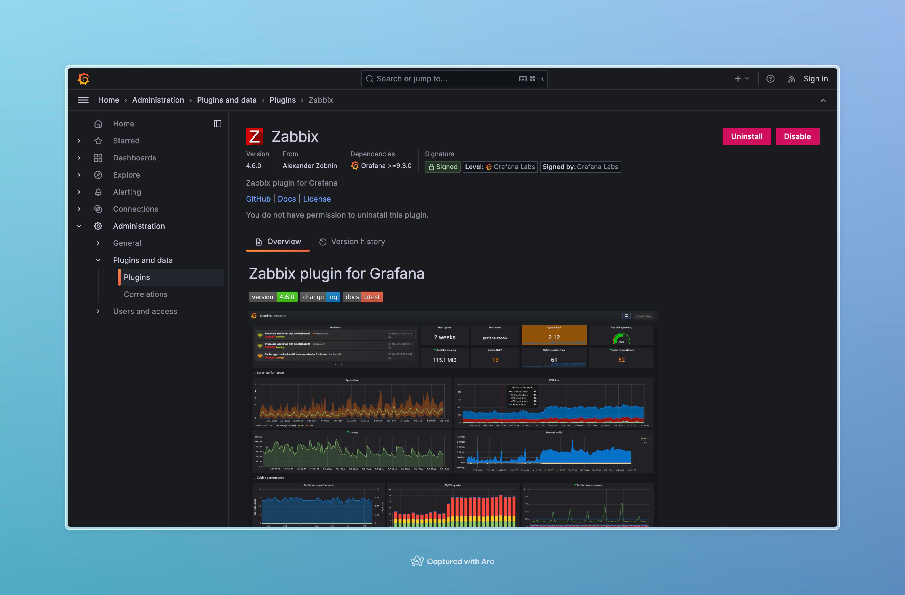
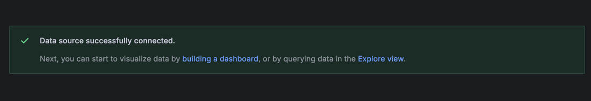

# ЛР 1. Loki + Zabbix + Grafana

Описание: 

### Часть 1. Логирование

1. Создать файл [docker-compose.yml](docker-compose.yaml), который содержит в себе тестовый сервис Nextcloud, Loki, Promtail, Grafana, Zabbix и Postgres для него
        
2. Создать файл [promtail_config.yml](promtail_config.yml) (или любое другое имя, главное чтоб совпадало с прописанным в композе)
    
3. Запустить compose файл, проверить что все “взлетело”
```shell
docker compose up --build
```


4. Для начала инициализируем Nextcloud. Для этого заходим на веб интерфейс через внешний порт, указанный в compose файле, создаем учетку и проверяем, что логи “пошли” в нужный нам файл /var/www/html/data/nextcloud.log


5. После инициализации Nextcloud проверяем в логах promtail, что он “подцепил” нужный нам log-файл: должны быть строчки, содержащие msg=Seeked /opt/nc_data/nextcloud.log


### Часть 2. Мониторинг

1. Теперь настраиваем Zabbix. Подключаемся к веб-интерфейсу (http://localhost:8082 или свой выбранный порт из композ файла) , креды Admin | zabbix

2. В разделе Data collection → Templates делаем Import кастомного шаблона (темплейта) для мониторинга nextcloud. Для импорта нужно предварительно создать yaml-файл ([template](template.yaml)):


3. Чтобы Zabbix и Nextcloud могли общаться по своим коротким именам внутри докеровской сети, в некстклауде необходимо “разрешить” это имя. Для этого нужно зайти на контейнер некстклауда под юзером www-data и выполнить команду php occ config:system:set trusted_domains 1 --value="nextcloud"

```shell
firs-iln@MacBook-Air-III endofworms % docker exec -it --user www-data a86af541b4ab /bin/bash             

www-data@a86af541b4ab:~/html$ php occ config:system:set trusted_domains 1 --value="nextcloud"
System config value trusted_domains => 1 set to string nextcloud
www-data@a86af541b4ab:~/html$ exit
```

4. В разделе Data collection → Hosts делаем (Create host). Указываем адрес (имя) контейнера nextcloud, видимое имя - любое, хост группа - Applications (но в целом можно любую другую). Чтобы не просто добавить хост, а начать его мониторинг, необходимо подключить к нему нужный шаблон мониторинга. Поэтому в поле Templates нужно выбрать добавленный на шаге 2 Templates/Applications→ Test ping template


5. Настройка хоста закончена, можно сохранить и перейти в раздел Monitoring → Latest data. Через какое-то время там должны появиться первые данные, в нашем случае значение healthy


### Часть 3. Визуализация

1. В терминале выполнить команду docker exec -it grafana bash -c "grafana cli plugins install alexanderzobnin-zabbix-app", затем docker restart grafana

```shell
firs-iln@MacBook-Air-III endofworms % docker exec -it grafana bash -c "grafana cli plugins install alexanderzobnin-zabbix-app" 
✔ Downloaded and extracted alexanderzobnin-zabbix-app v4.6.0 zip successfully to /var/lib/grafana/plugins/alexanderzobnin-zabbix-app

Please restart Grafana after installing or removing plugins. Refer to Grafana documentation for instructions if necessary.

firs-iln@MacBook-Air-III endofworms % docker restart grafana
grafana
```

2. Заходим в графану (по умолчанию http://localhost:3000/), раздел Administration → Plugins. Найти там Zabbix, активировать (Enable)


3. Подключаем Loki к Grafana, раздел Connections → Data sources → Loki. В настройках подключения указать любое имя и адрес http://loki:3100, все остальное можно оставить по дефолту:


4. Сохранить подключение, нажав Save & Test. Если нет ошибок и сервис предлагает перейти к визуализации и/или просмотру данных, значит в Части 1 все настроено правильно


5. Точно так же с забиксом: снова подключаем новый датасурс, в этот раз Zabbix. В качестве URL указываем http://zabbix-front:8080/api_jsonrpc.php, заполняем Username и Password, через Save & test проверяем, что подключение успешно


6. Собственно, можно перейти в Explore (на этой же странице или через общее меню), выбрать в качестве селектора (индекса) job либо filename — если все было правильно настроено, то нужные значения будут в выпадающем списке. Затем нажать Run query и увидеть свои логи (но это неточно)


7. То же самое с забиксом, при выставлении всех фильтров:


### Задание:
Создаем дашборд для мониторинга Nextcloud.


### Вопросы:

1. *Чем SLO отличается от SLA?*

SLO — внутренняя цель сервиса по доступности, то, к чему стремится команда
SLA — формальное соглашение между поставщиком и клиентом, определяющее необходимый уровень доступности сервиса и включающий санкции за невыполнение указанных требований.

2. *Чем отличается инкрементальный бэкап от дифференциального?*

Инкрементальный бекап — история изменений с момента последнего бекапа любого рода
Дифференциальный бекап — история изменений с момента последнего *полного* бекапа

Например:

`полный -> инкрементальный -> инкрементальный` — в такой ситуации последний бекап будет содержать изменения от первого инкрементального бекапа
`полный -> дифференциальный -> дифференциальный` — в такой ситуации последний бекап будет содержать изменения от первого бекапа (полного)

3. *В чем разница между мониторингом и observability?*
Мониторинг фокусируется на известных метриках и заранее настроенных оповещениях, полезен для контроля текущего состояния. 
Observability дает возможность анализировать поведение системы с использованием метрик, логов и трассировок, что помогает выявлять и устранять неизвестные проблемы.
Вместе они дополняют друг друга: мониторинг указывает на проблему, а наблюдаемость помогает понять причину.