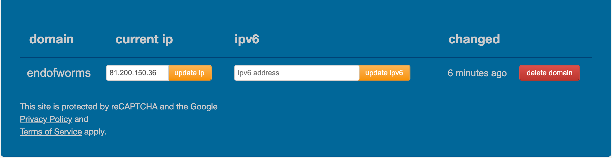
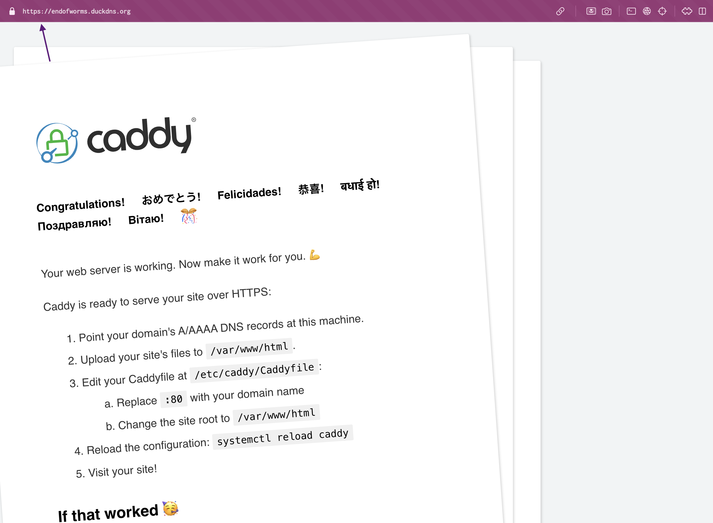
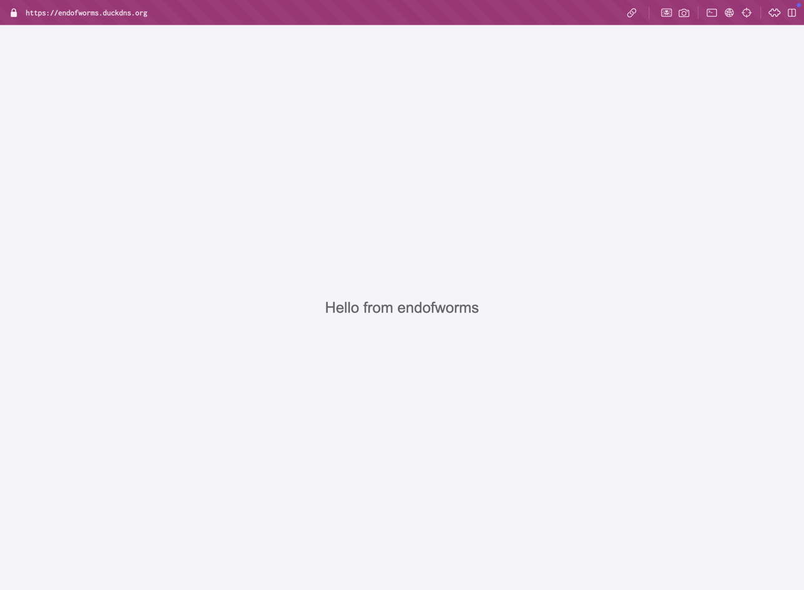
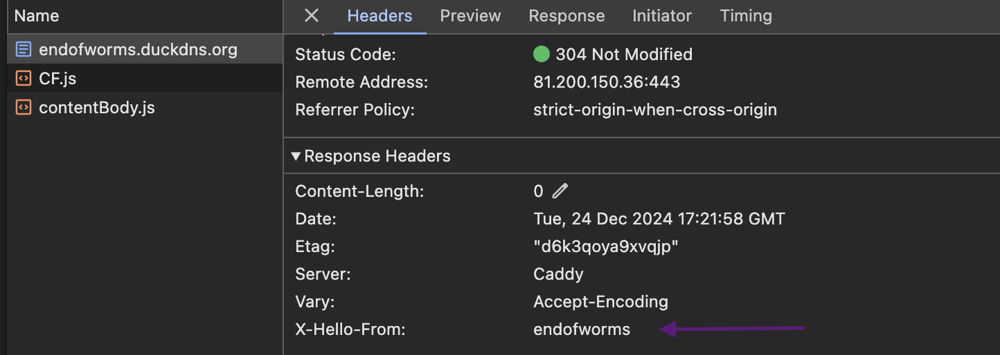

# ЛР 2. Ansible + Caddy

- **Задача**
    
    На целевом сервере установить Ansible и вебсервер Caddy

## Ход работы:

### Часть 1. Установка и настройка Ansible

1. Устанавливаем пакетный менеджер pip для нашего python: `curl https://bootstrap.pypa.io/get-pip.py -o get-pip.py && python3 get-pip.py`
2. Устанавливаем, собственно, ansible: `python3 -m pip install ansible`
3. Выбираем или создаем директорию, где будем работать. Создаем базовый конфиг файл, затем папку inventory и в ней файл с хостами (тренироваться будем на localhost)
    - `ansible.cfg`
        
        ```toml
        [defaults]
        host_key_checking  = false
        inventory          = inventory/hosts
        ```
        
    - `inventory/hosts`
        
        ```toml
        [my_servers]
        local_server    ansible_host=localhost
        ```
        
4. Проверяем, что сервер с Ansible подключился к “клиенту” (в нашем случае это одна и та же машина, localhost): `ansible my_servers -m ping -c local` и/или `ansible my_servers -m setup -c local`

```shell
root@3998927-nc74840:~/lab2# ansible my_servers -m ping -c local
local_server | SUCCESS => {
    "ansible_facts": {
        "discovered_interpreter_python": "/usr/bin/python3.10"
    },
    "changed": false,
    "ping": "pong"
}
```

5. Пробуем выполнить команду посложнее на нашем клиенте

```shell
root@3998927-nc74840:~/lab2# ansible my_servers -c local -m shell -a 'echo meow > $HOME/test.txt'
local_server | CHANGED | rc=0 >>

root@3998927-nc74840:~/lab2# ls -la ..
total 2272
drwx------  8 root root    4096 Dec 24 19:22 .
drwxr-xr-x 20 root root    4096 Dec 24 19:11 ..
drwx------  3 root root    4096 Dec 23 12:19 .ansible
-rw-r--r--  1 root root       0 Dec 23 12:22 .bash_history
-rw-r--r--  1 root root    3106 Oct 15  2021 .bashrc
drwx------  3 root root    4096 Dec 24 19:16 .cache
drwxr-xr-x  3 root root    4096 Dec 24 19:19 .local
-rw-r--r--  1 root root     161 Jul  9  2019 .profile
drwx------  2 root root    4096 Dec 24 19:11 .ssh
-rw-r--r--  1 root root 2275758 Dec 24 19:16 get-pip.py
drwxr-xr-x  3 root root    4096 Dec 24 19:19 lab2
-rw-r--r--  1 root root    1372 Dec 24 19:10 resize.log
drwx------  3 root root    4096 Dec 23 12:18 snap
-rw-r--r--  1 root root       5 Dec 24 19:22 test.txt
root@3998927-nc74840:~/lab2# ansible my_servers -c local -m file -a 'path=$HOME/text.txt state=absent'
local_server | SUCCESS => {
    "ansible_facts": {
        "discovered_interpreter_python": "/usr/bin/python3.10"
    },
    "changed": false,
    "path": "/root/text.txt",
    "state": "absent"
}

```

### Часть 2. Установка Caddy

1. В части 1 были рассмотрены базовые ad-hoc команды для Ansible, пора переходить к более сложным конструкциям - Ansible Playbooks. Устанавливать будем вебсервер Caddy. Для начала создадим в рабочей директории папку roles и в ней инициализируем исходное конфигурационное “дерево”: ansible-galaxy init caddy_deploy

```shell
root@3998927-nc74840:~/lab2# mkdir roles
root@3998927-nc74840:~/lab2# cd roles
root@3998927-nc74840:~/lab2/roles# ansible-galaxy init caddy_deploy
- Role caddy_deploy was created successfully
root@3998927-nc74840:~/lab2/roles# tree
.
└── caddy_deploy
    ├── README.md
    ├── defaults
    │   └── main.yml
    ├── files
    ├── handlers
    │   └── main.yml
    ├── meta
    │   └── main.yml
    ├── tasks
    │   └── main.yml
    ├── templates
    ├── tests
    │   ├── inventory
    │   └── test.yml
    └── vars
        └── main.yml

9 directories, 8 files
```

2. Наполняем файл roles/caddy_deploy/tasks/main.yml. Здесь мы описываем непосредственно шаги, которые будут выполняться в нашем плейбуке (по сути, несколько команд ansible -m ****** подряд)

```shell
root@3998927-nc74840:~/lab2/roles# nano caddy_deploy/tasks/main.yml 
root@3998927-nc74840:~/lab2/roles# cat caddy_deploy/tasks/main.yml 
---
# tasks file for caddy_deploy

- name: Install prerequisites
  apt:
    pkg:
    - debian-keyring
    - debian-archive-keyring
    - apt-transport-https
    - curl

- name: Add key for Caddy repo
  apt_key:
    url: https://dl.cloudsmith.io/public/caddy/stable/gpg.key
    state: present
    keyring: /usr/share/keyrings/caddy-stable-archive-keyring.gpg

- name: add Caddy repo
  apt_repository:
    repo: "deb [signed-by=/usr/share/keyrings/caddy-stable-archive-keyring.gpg] https://dl.cloudsmith.io/public/caddy/stable/deb/debian any-version main"
    state: present
    filename: caddy-stable

- name: add Caddy src repo
  apt_repository:
    repo: "deb-src [signed-by=/usr/share/keyrings/caddy-stable-archive-keyring.gpg] https://dl.cloudsmith.io/public/caddy/stable/deb/debian any-version main"
    state: present
    filename: caddy-stable

- name: Install Caddy webserver
  apt:
    name: caddy
    update_cache: yes
    state: present
```

3. Наконец, в рабочей директории создаем собственно файл конфигурации самого плейбука, где указываем нужные нам хосты и роли
```shell
root@3998927-nc74840:~/lab2/roles# cd ..
root@3998927-nc74840:~/lab2# nano caddy_deploy.yml
root@3998927-nc74840:~/lab2# cat caddy_deploy.yml 
- name: Install and configure Caddy webserver
  hosts: my_servers
  connection: local

  roles:
    - caddy_deploy
```

4. Запускаем плейбук: ansible-playbook caddy_deploy.yml и проверяем, успешно ли все шаги выполнились
```shell
root@3998927-nc74840:~/lab2# ansible-playbook caddy_deploy.yml

PLAY [Install and configure Caddy webserver] **************************************************************************************************************************

TASK [Gathering Facts] ************************************************************************************************************************************************
[WARNING]: Platform linux on host local_server is using the discovered Python interpreter at /usr/bin/python3.10, but future installation of another Python
interpreter could change the meaning of that path. See https://docs.ansible.com/ansible-core/2.17/reference_appendices/interpreter_discovery.html for more
information.
ok: [local_server]

TASK [caddy_deploy : Install prerequisites] ***************************************************************************************************************************
changed: [local_server]

TASK [caddy_deploy : Add key for Caddy repo] **************************************************************************************************************************
changed: [local_server]

TASK [caddy_deploy : add Caddy repo] **********************************************************************************************************************************
changed: [local_server]

TASK [caddy_deploy : add Caddy src repo] ******************************************************************************************************************************
changed: [local_server]

TASK [caddy_deploy : Install Caddy webserver] *************************************************************************************************************************
changed: [local_server]

PLAY RECAP ************************************************************************************************************************************************************
local_server               : ok=6    changed=5    unreachable=0    failed=0    skipped=0    rescued=0    ignored=0   

root@3998927-nc74840:~/lab2# service caddy status
● caddy.service - Caddy
     Loaded: loaded (/lib/systemd/system/caddy.service; enabled; vendor preset: enabled)
     Active: active (running) since Tue 2024-12-24 19:32:36 MSK; 13s ago
       Docs: https://caddyserver.com/docs/
   Main PID: 4134 (caddy)
      Tasks: 6 (limit: 1067)
     Memory: 11.9M
        CPU: 77ms
     CGroup: /system.slice/caddy.service
             └─4134 /usr/bin/caddy run --environ --config /etc/caddy/Caddyfile

Dec 24 19:32:36 3998927-nc74840 caddy[4134]: {"level":"info","ts":1735057956.0099223,"msg":"adapted config to JSON","adapter":"caddyfile"}
Dec 24 19:32:36 3998927-nc74840 caddy[4134]: {"level":"info","ts":1735057956.0151327,"logger":"admin","msg":"admin endpoint started","address":"localhost:2019","enfor>
Dec 24 19:32:36 3998927-nc74840 caddy[4134]: {"level":"warn","ts":1735057956.015457,"logger":"http.auto_https","msg":"server is listening only on the HTTP port, so no>
Dec 24 19:32:36 3998927-nc74840 caddy[4134]: {"level":"info","ts":1735057956.015754,"logger":"http.log","msg":"server running","name":"srv0","protocols":["h1","h2","h>
Dec 24 19:32:36 3998927-nc74840 caddy[4134]: {"level":"info","ts":1735057956.0160031,"msg":"autosaved config (load with --resume flag)","file":"/var/lib/caddy/.config>
Dec 24 19:32:36 3998927-nc74840 systemd[1]: Started Caddy.
Dec 24 19:32:36 3998927-nc74840 caddy[4134]: {"level":"info","ts":1735057956.0256371,"msg":"serving initial configuration"}
Dec 24 19:32:36 3998927-nc74840 caddy[4134]: {"level":"info","ts":1735057956.0259192,"logger":"tls.cache.maintenance","msg":"started background certificate maintenanc>
Dec 24 19:32:36 3998927-nc74840 caddy[4134]: {"level":"info","ts":1735057956.0276463,"logger":"tls","msg":"cleaning storage unit","storage":"FileStorage:/var/lib/cadd>
Dec 24 19:32:36 3998927-nc74840 caddy[4134]: {"level":"info","ts":1735057956.027988,"logger":"tls","msg":"finished cleaning storage units"}
```

### Часть 3. Домен и настройка Caddyfile

1. Регистрируем себе бесплатный домен на выданный ранее ip-адрес, например на сервисе duckdns.org

duckdns маппит домен к IP, с которого пришел запрос. чтобы перемаппить его на IP сервера, нужно сделать запрос с сервера к duckdns

duckdns предоставляет инструкцию (учитывает домен): https://www.duckdns.org/install.jsp?tab=linux-cron&domain=endofworms

```shell
root@3998927-nc74840:~/lab2# mkdir duckdns
cd duckdns
root@3998927-nc74840:~/lab2/duckdns# nano duck.sh
root@3998927-nc74840:~/lab2/duckdns# cat duck.sh
echo url="https://www.duckdns.org/update?domains=endofworms&token=e71fd2a7-b999-44fb-b6dc-1c330cff8402&ip=" | curl -k -o ~/lab2/duckdns/duck.log -K -
root@3998927-nc74840:~/lab2/duckdns# ./duck.sh 
  % Total    % Received % Xferd  Average Speed   Time    Time     Time  Current
                                 Dload  Upload   Total   Spent    Left  Speed
100     2    0     2    0     0      0      0 --:--:--  0:00:05 --:--:--     0
root@3998927-nc74840:~/lab2/duckdns# cat duck.log 
OK
```


2. Попробуем использовать доп. возможности плейбуков - создадим шаблон (Jinja2) и переменные (в формате {{ var }})

```shell
root@3998927-nc74840:~/lab2# cd roles
root@3998927-nc74840:~/lab2/roles# cd caddy_deploy/
root@3998927-nc74840:~/lab2/roles/caddy_deploy# cd templates
root@3998927-nc74840:~/lab2/roles/caddy_deploy/templates# ls
root@3998927-nc74840:~/lab2/roles/caddy_deploy/templates# nano Caddyfile.j2
root@3998927-nc74840:~/lab2/roles/caddy_deploy/templates# cat Caddyfile.j2 
{{ domain_name }} {
        root * /usr/share/caddy
        file_server

        log {
                output file {{ log.file }}
                format json
                level {{ log.level }}
        }
}
root@3998927-nc74840:~/lab2/roles/caddy_deploy/templates# cd ..
root@3998927-nc74840:~/lab2/roles/caddy_deploy# cd vars
root@3998927-nc74840:~/lab2/roles/caddy_deploy/vars# nano main.yml
root@3998927-nc74840:~/lab2/roles/caddy_deploy/vars# cat main.yml
---
# vars file for caddy_deploy
domain_name: endofworms.duckdns.org

log:
  file: /var/log/caddy_access.log
  level: "INFO"
```

3. Добавляем в наш плейбук (в tasks) новые шаги, отвечающие за создание конфигурационного файла из шаблона и последующую перезагрузку сервиса:

```shell
root@3998927-nc74840:~/lab2/roles/caddy_deploy/tasks# nano main.yml

root@3998927-nc74840:~/lab2/roles/caddy_deploy/tasks# cat main.yml 
---
# tasks file for caddy_deploy

- name: Install prerequisites
  apt:
    pkg:
    - debian-keyring
    - debian-archive-keyring
    - apt-transport-https
    - curl

- name: Add key for Caddy repo
  apt_key:
    url: https://dl.cloudsmith.io/public/caddy/stable/gpg.key
    state: present
    keyring: /usr/share/keyrings/caddy-stable-archive-keyring.gpg

- name: add Caddy repo
  apt_repository:
    repo: "deb [signed-by=/usr/share/keyrings/caddy-stable-archive-keyring.gpg] https://dl.cloudsmith.io/public/caddy/stable/deb/debian any-version main"
    state: present
    filename: caddy-stable

- name: add Caddy src repo
  apt_repository:
    repo: "deb-src [signed-by=/usr/share/keyrings/caddy-stable-archive-keyring.gpg] https://dl.cloudsmith.io/public/caddy/stable/deb/debian any-version main"
    state: present
    filename: caddy-stable

- name: Install Caddy webserver
  apt:
    name: caddy
    update_cache: yes
    state: present

- name: Create config file
  template:
    src: templates/Caddyfile.j2
    dest: /etc/caddy/Caddyfile

- name: Reload with new config
  service:
    name: caddy
    state: reloaded
```

4. Снова запускаем плейбук, после чего вводим в браузере имя своего домена и убеждаемся, что тестовая страничка Caddy автоматически поднялась на подписанном сертификате с https

```shell
root@3998927-nc74840:~/lab2# ansible-playbook caddy_deploy.yml

PLAY [Install and configure Caddy webserver] **************************************************************************************************************************

TASK [Gathering Facts] ************************************************************************************************************************************************
[WARNING]: Platform linux on host local_server is using the discovered Python interpreter at /usr/bin/python3.10, but future installation of another Python
interpreter could change the meaning of that path. See https://docs.ansible.com/ansible-core/2.17/reference_appendices/interpreter_discovery.html for more
information.
ok: [local_server]

TASK [caddy_deploy : Install prerequisites] ***************************************************************************************************************************
ok: [local_server]

TASK [caddy_deploy : Add key for Caddy repo] **************************************************************************************************************************
ok: [local_server]

TASK [caddy_deploy : add Caddy repo] **********************************************************************************************************************************
ok: [local_server]

TASK [caddy_deploy : add Caddy src repo] ******************************************************************************************************************************
ok: [local_server]

TASK [caddy_deploy : Install Caddy webserver] *************************************************************************************************************************
ok: [local_server]

TASK [caddy_deploy : Create config file] ******************************************************************************************************************************
changed: [local_server]

TASK [caddy_deploy : Reload with new config] **************************************************************************************************************************
changed: [local_server]

PLAY RECAP ************************************************************************************************************************************************************
local_server               : ok=8    changed=2    unreachable=0    failed=0    skipped=0    rescued=0    ignored=0   
```



## Задания:

1. Переписать пример с созданием и удалением файла из шага 5 Части 1 с ad-hoc команд на плейбук формат, а так же добавить четвертый шаг - перед удалением поменять содержимое файла на любое другое.

```shell
root@3998927-nc74840:~/lab2# nano manage_file.yml
root@3998927-nc74840:~/lab2# cat manage_file.yml 
- name: Manage test file
  hosts: my_servers
  connection: local

  tasks:
    - name: Create test file with initial content
      copy:
        dest: "{{ ansible_env.HOME }}/test.txt"
        content: "meow"

    - name: Display file content after creation
      command: cat "{{ ansible_env.HOME }}/test.txt"
      register: file_content
      changed_when: false

    - name: Show content after creation
      debug:
        msg: "File content: {{ file_content.stdout }}"

    - name: Modify test file content
      copy:
        dest: "{{ ansible_env.HOME }}/test.txt"
        content: "new content"

    - name: Display file content after modification
      command: cat "{{ ansible_env.HOME }}/test.txt"
      register: file_content
      changed_when: false

    - name: Show content after modification
      debug:
        msg: "File content: {{ file_content.stdout }}"

    - name: Remove test file
      file:
        path: "{{ ansible_env.HOME }}/test.txt"
        state: absent

root@3998927-nc74840:~/lab2# ansible-playbook manage_file.yml

PLAY [Manage test file] ***********************************************************************************************************************************************

TASK [Gathering Facts] ************************************************************************************************************************************************
[WARNING]: Platform linux on host local_server is using the discovered Python interpreter at /usr/bin/python3.10, but future installation of another Python
interpreter could change the meaning of that path. See https://docs.ansible.com/ansible-core/2.17/reference_appendices/interpreter_discovery.html for more
information.
ok: [local_server]

TASK [Create test file with initial content] **************************************************************************************************************************
changed: [local_server]

TASK [Display file content after creation] ****************************************************************************************************************************
ok: [local_server]

TASK [Show content after creation] ************************************************************************************************************************************
ok: [local_server] => {
    "msg": "File content: meow"
}

TASK [Modify test file content] ***************************************************************************************************************************************
changed: [local_server]

TASK [Display file content after modification] ************************************************************************************************************************
ok: [local_server]

TASK [Show content after modification] ********************************************************************************************************************************
ok: [local_server] => {
    "msg": "File content: new content"
}

TASK [Remove test file] ***********************************************************************************************************************************************
changed: [local_server]

PLAY RECAP ************************************************************************************************************************************************************
local_server               : ok=8    changed=3    unreachable=0    failed=0    skipped=0    rescued=0    ignored=0   
```


```shell
root@3998927-nc74840:~/lab2/roles/caddy_deploy/templates# nano Caddyfile.j2 
root@3998927-nc74840:~/lab2/roles/caddy_deploy/templates# 
root@3998927-nc74840:~/lab2/roles/caddy_deploy/templates# 
root@3998927-nc74840:~/lab2/roles/caddy_deploy/templates# 
root@3998927-nc74840:~/lab2/roles/caddy_deploy/templates# cat Caddyfile.j2 
{{ domain_name }} {
        root * /usr/share/caddy
        file_server {
                index index.html
        }

        header {
                X-Hello-From "endofworms"
        }

        log {
                output file {{ log.file }}
                format json
                level {{ log.level }}
        }
}
```

```shell
root@3998927-nc74840:~/lab2/roles/caddy_deploy/files# nano index.html

root@3998927-nc74840:~/lab2/roles/caddy_deploy/files# cat index.html 
<!DOCTYPE html>
<html lang="en">
<head>
    <meta charset="UTF-8">
    <meta name="viewport" content="width=device-width, initial-scale=1.0">
    <title>Caddy Custom Page</title>
    <style>
        body {
            font-family: Arial, sans-serif;
            margin: 0;
            padding: 0;
            display: flex;
            flex-direction: column;
            align-items: center;
            justify-content: center;
            height: 100vh;
            background-color: #f4f4f9;
            color: #333;
        }
        p {
            font-size: 1.5rem;
            margin: 0;
            color: #666;
        }
    </style>
</head>
<body>
    <p>Hello from endofworms</p>
</body>
</html>
```

```shell
root@3998927-nc74840:~/lab2/roles/caddy_deploy/tasks# nano main.yml
root@3998927-nc74840:~/lab2/roles/caddy_deploy/tasks# cat main.yml 
---
# tasks file for caddy_deploy

- name: Install prerequisites
  apt:
    pkg:
    - debian-keyring
    - debian-archive-keyring
    - apt-transport-https
    - curl

- name: Add key for Caddy repo
  apt_key:
    url: https://dl.cloudsmith.io/public/caddy/stable/gpg.key
    state: present
    keyring: /usr/share/keyrings/caddy-stable-archive-keyring.gpg

- name: Add Caddy repo
  apt_repository:
    repo: "deb [signed-by=/usr/share/keyrings/caddy-stable-archive-keyring.gpg] https://dl.cloudsmith.io/public/caddy/stable/deb/debian any-version main"
    state: present
    filename: caddy-stable

- name: Add Caddy src repo
  apt_repository:
    repo: "deb-src [signed-by=/usr/share/keyrings/caddy-stable-archive-keyring.gpg] https://dl.cloudsmith.io/public/caddy/stable/deb/debian any-version main"
    state: present
    filename: caddy-stable

- name: Install Caddy webserver
  apt:
    name: caddy
    update_cache: yes
    state: present

- name: Create config file
  template:
    src: templates/Caddyfile.j2
    dest: /etc/caddy/Caddyfile

- name: Copy custom index.html
  copy:
    src: files/index.html
    dest: /usr/share/caddy/index.html

- name: Reload Caddy with new config
  service:
    name: caddy
    state: reloaded
```

```shell
root@3998927-nc74840:~/lab2# ansible-playbook caddy_deploy.yml

PLAY [Install and configure Caddy webserver] **************************************************************************************************************************

TASK [Gathering Facts] ************************************************************************************************************************************************
[WARNING]: Platform linux on host local_server is using the discovered Python interpreter at /usr/bin/python3.10, but future installation of another Python
interpreter could change the meaning of that path. See https://docs.ansible.com/ansible-core/2.17/reference_appendices/interpreter_discovery.html for more
information.
ok: [local_server]

TASK [caddy_deploy : Install prerequisites] ***************************************************************************************************************************
ok: [local_server]

TASK [caddy_deploy : Add key for Caddy repo] **************************************************************************************************************************
ok: [local_server]

TASK [caddy_deploy : Add Caddy repo] **********************************************************************************************************************************
ok: [local_server]

TASK [caddy_deploy : Add Caddy src repo] ******************************************************************************************************************************
ok: [local_server]

TASK [caddy_deploy : Install Caddy webserver] *************************************************************************************************************************
ok: [local_server]

TASK [caddy_deploy : Create config file] ******************************************************************************************************************************
changed: [local_server]

TASK [caddy_deploy : Copy custom index.html] **************************************************************************************************************************
changed: [local_server]

TASK [caddy_deploy : Reload Caddy with new config] ********************************************************************************************************************
changed: [local_server]

PLAY RECAP ************************************************************************************************************************************************************
local_server               : ok=9    changed=3    unreachable=0    failed=0    skipped=0    rescued=0    ignored=0   
```

