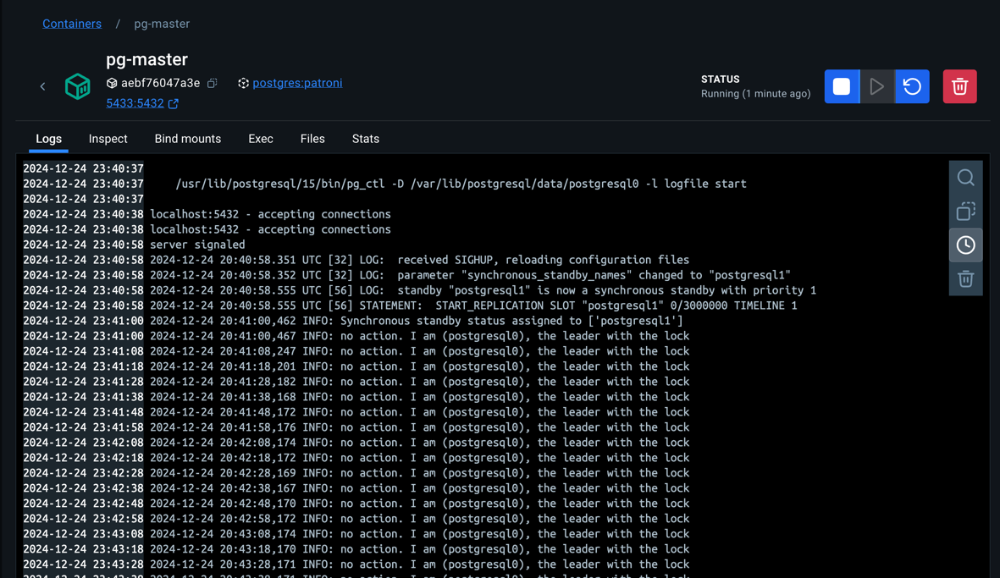
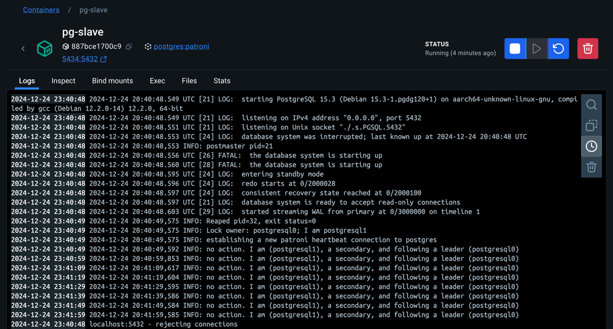
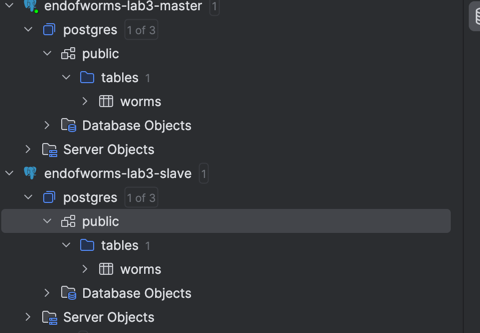
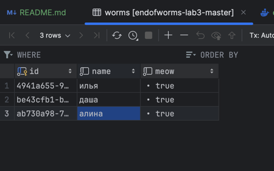
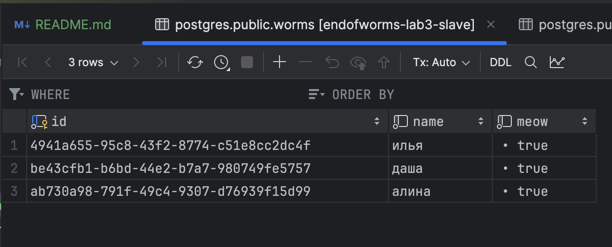
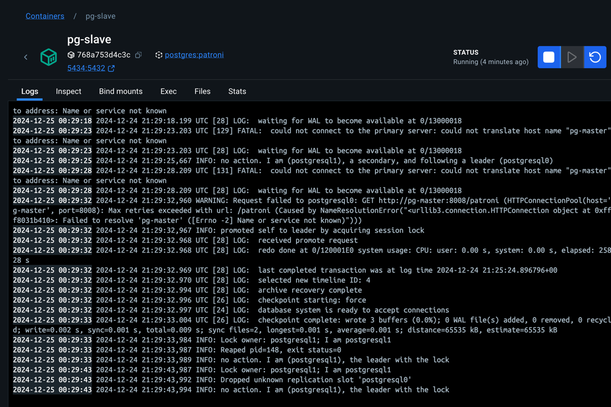
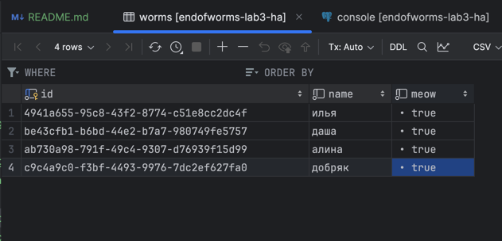
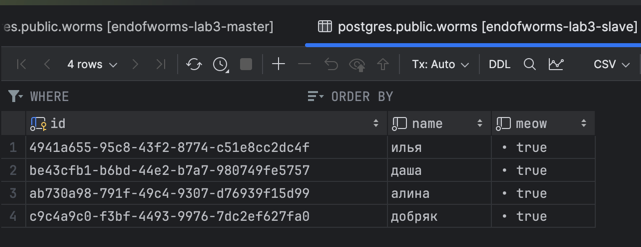
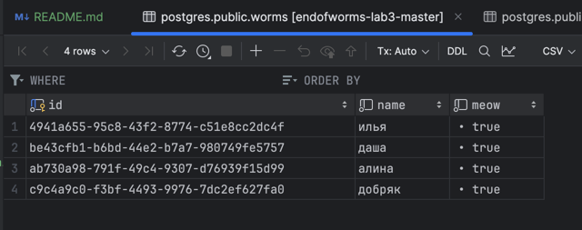

# ЛР 3. HA Postgres Cluster

- Задача

   Развернуть и настроить высокодоступный кластер Postgres с возможностью автоматической синхронизации узла после его возвращения в кластер.
    
- Дополнение: Улучшить лабораторную, настроив кластер так, чтобы после “возвращения” второй ноды в кластер она *автоматически* получала данные, которые были записаны в ее отсутствие

## Ход работы

### Часть 1: поднимаем Postgres

1. Подготавливаем [Dockerfile](Dockerfile) для pg. Кластеризацию будем делать с помощью Patroni, который требует доступ к бинарникам Postgres. Для этого создаём образ, включающий Postgres и Patroni.

```Dockerfile
FROM postgres:15

# это фикс
RUN echo "en_US.UTF-8 UTF-8" > /etc/locale.gen && \
    locale-gen en_US.UTF-8

ENV LANG=en_US.UTF-8
ENV LANGUAGE=en_US:en
ENV LC_ALL=en_US.UTF-8

RUN apt-get update -y && \
    apt-get install -y netcat-openbsd python3-pip curl python3-psycopg2 python3-venv iputils-ping

RUN python3 -m venv /opt/patroni-venv && \
    /opt/patroni-venv/bin/pip install --upgrade pip && \
    /opt/patroni-venv/bin/pip install patroni[zookeeper] psycopg2-binary

# это фикс
RUN mkdir -p /var/lib/postgresql/wal_archive && \
    chown -R postgres:postgres /var/lib/postgresql/wal_archive && \
    chmod 700 /var/lib/postgresql/wal_archive

COPY postgres0.yml /postgres0.yml
COPY postgres1.yml /postgres1.yml

ENV PATH="/opt/patroni-venv/bin:$PATH"

USER postgres
```

2. Создаем [docker-compose](docker-compose.yml), описывающий развертывание Postgres с использованием Zookeeper для управления репликацией.

```yaml
services:
  pg-master:
    build: .
    image: localhost/postgres:patroni
    container_name: pg-master
    restart: always
    hostname: pg-master
    environment:
      POSTGRES_USER: postgres
      POSTGRES_PASSWORD: postgres
      PGDATA: '/var/lib/postgresql/data/pgdata'
    expose:
      - 8008
    ports:
      - 5433:5432
    volumes:
      - pg-master:/var/lib/postgresql/data
      - pg-wal-archive:/var/lib/postgresql/wal_archive # Архив WAL для синхронизации
    command: patroni /postgres0.yml

  pg-slave:
    build: .
    image: localhost/postgres:patroni
    container_name: pg-slave
    restart: always
    hostname: pg-slave
    expose:
      - 8008
    ports:
      - 5434:5432
    volumes:
      - pg-slave:/var/lib/postgresql/data
      - pg-wal-archive:/var/lib/postgresql/wal_archive # Архив WAL для синхронизации
    environment:
      POSTGRES_USER: postgres
      POSTGRES_PASSWORD: postgres
      PGDATA: '/var/lib/postgresql/data/pgdata'
    command: patroni /postgres1.yml

  zoo:
    image: confluentinc/cp-zookeeper:7.7.1
    container_name: zoo
    restart: always
    hostname: zoo
    ports:
      - 2181:2181
    environment:
      ZOOKEEPER_CLIENT_PORT: 2181
      ZOOKEEPER_TICK_TIME: 2000

volumes:
  pg-master:
  pg-slave:
  pg-wal-archive:
```

3. Создаём конфигурацию Patroni ([postgres0](postgres0.yml), [postgres1](postgres1.yml))

```yaml
scope: my_cluster
name: postgresql0

restapi:
  listen: pg-master:8008
  connect_address: pg-master:8008

zookeeper:
  hosts:
    - zoo:2181

bootstrap:
  dcs:
    ttl: 30
    loop_wait: 10
    retry_timeout: 10
    maximum_lag_on_failover: 10485760
    synchronous_mode: true
    postgresql:
      use_pg_rewind: true
      use_slots: true
      parameters:
        wal_level: replica
        hot_standby: "on"
        wal_keep_segments: 32
        max_wal_senders: 10
        max_replication_slots: 10
        archive_mode: "on"
        archive_command: 'test ! -f /var/lib/postgresql/wal_archive/%f && cp %p /var/lib/postgresql/wal_archive/%f'
        archive_timeout: 60
  pg_hba:
  - host replication replicator 0.0.0.0/0 md5
  - host all all 0.0.0.0/0 md5

postgresql:
  listen: 0.0.0.0:5432
  connect_address: pg-master:5432
  data_dir: /var/lib/postgresql/data/postgresql0
  bin_dir: /usr/lib/postgresql/15/bin
  pgpass: /tmp/pgpass0
  remove_data_directory_on_rewind_failure: true
  authentication:
    replication:
      username: replicator
      password: rep-pass
    superuser:
      username: postgres
      password: postgres
  parameters:
    unix_socket_directories: '.'
    wal_keep_segments: 64
    max_wal_size: 1GB

recovery_conf:
  restore_command: 'cp /var/lib/postgresql/wal_archive/%f %p'

watchdog:
  mode: off

tags:
  nofailover: false
  noloadbalance: false
  clonefrom: false
  nosync: false

```

4. Деплоим

```shell
docker compose up --build -d
```



### Часть 2. Проверяем репликацию

1. Подключаемся к нодам через любой клиент Postgres (pg-master:5433, pg-slave:5434).
2. Создаем таблицу и записываем данные на мастер-ноде.
```postgresql
create table worms
(
    id   uuid default gen_random_uuid() not null
        constraint worms_pk
            primary key,
    name text                           not null,
    meow bool default true              not null
);

alter table worms
    owner to postgres;
```

После создания таблицы на мастер-ноде, слейв тоже получил обновление


Добавим данные:


3. Проверяем, что данные появились на слейв-ноде. 



Синхронизация произошла, uuid совпадают, все отлично

4. Убеждаемся, что слейв-нода работает в режиме readonly.

Попробуем записать данные в слейв:


### Часть 3. Делаем высокую доступность

1. Добавляем HAProxy в [docker-compose](docker-compose.yml):

```yaml
haproxy:
  image: haproxy:3.0
  container_name: postgres_entrypoint
  ports:
    - 5432:5432
    - 7000:7000
  depends_on:
    - pg-master
    - pg-slave
    - zoo
  volumes:
    - ./haproxy.cfg:/usr/local/etc/haproxy/haproxy.cfg
```

2. Создаем [haproxy.cfg](haproxy.cfg)

```
global
    maxconn 100

defaults
    log global
    mode tcp
    retries 3
    timeout client 30m
    timeout connect 4s
    timeout server 30m
    timeout check 5s

listen stats
    mode http
    bind *:7000
    stats enable
    stats uri /
    stats refresh 10s
    stats show-legends
    stats admin if TRUE

listen postgres
    bind *:5432
    option httpchk GET /patroni
    http-check expect status 200
    default-server inter 3s fall 3 rise 2 on-marked-down shutdown-sessions
    server postgresql_pg_master_5432 pg-master:5432 maxconn 100 check port 8008
    server postgresql_pg_slave_5432 pg-slave:5432 maxconn 100 check port 8008
```

3. Перезапускаем проект и проверяем работу HAProxy.

```shell
docker compose stop
docker compose up --build -d 
```

Ноды поднялись, роли распределились, зукипер подцепился

```shell
2024-12-25 00:25:17 [WARNING]  (8) : Server postgres/postgresql_pg_master_5432 is UP, reason: Layer7 check passed, code: 200, check duration: 3ms. 1 active and 0 backup servers online. 0 sessions requeued, 0 total in queue.
2024-12-25 00:25:19 [WARNING]  (8) : Server postgres/postgresql_pg_slave_5432 is UP, reason: Layer7 check passed, code: 200, check duration: 1ms. 2 active and 0 backup servers online. 0 sessions requeued, 0 total in queue.
```

Проверим синхронизацию при отключении:



Добавим данные через haproxy:



Данные добавились в слейв



Запускаем мастер:



Данные пришли, все отлично 👍🏼